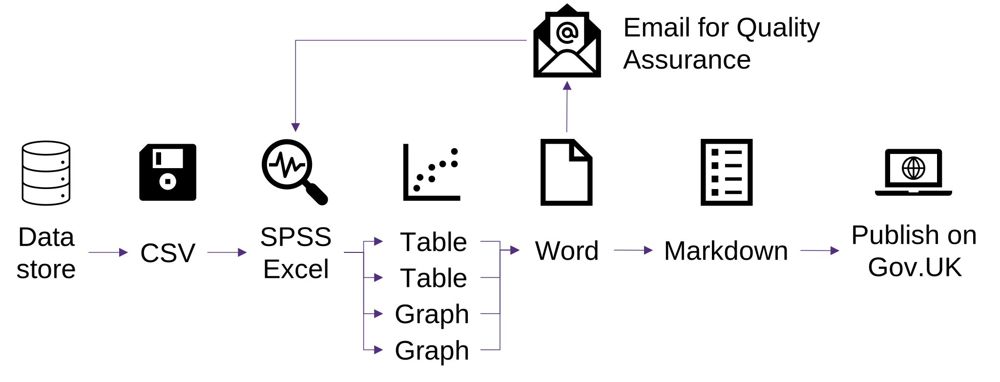

> ## Main messages
> - All analysts should aim towards “RAP by default” ways of working, as part of broader Government aims.
> - Iterative improvements can be made using our [bronze, silver and gold standards of RAP](rap-framework), recognising that RAP is not an all-or-nothing exercise.
> - A cultural change should be supported at all levels to support the enhanced roll-out of RAP, ensuring that analysts have the tools, time and resources needed to develop and implement the necessary skills.

UKHSA colleagues are encouraged to join our internal RAP network to seek support and share knowledge. To do so, or for any other queries related to RAP, please contact <UKHSA.RAP@ukhsa.gov.uk>.



For a more detailed description of the skills and techniques involved in RAP, please see the [bronze-silver-gold framework page](rap-framework).

## The principles of RAP

Good analysis should be reproducible, transparent, trustworthy, auditable, efficient, and high quality.

The principles of RAP draw upon best practices from the field of software engineering to achieve these aims. They avoid the pitfalls associated with more manual processes reliant on opaque “point-and-click” operations which can be inefficient, difficult to reproduce, and difficult to properly quality assure or audit.

Having a transparent and reproducible analytical pipeline allows us to show that we have done what we have said we have done. It allows our users and other analysts to follow and reproduce the process and understand the results. Good peer review and audit also rely on reproducibility, which further promotes the quality of, and trust in, our analytical outputs (trustworthiness and quality are two of the main pillars of the [Code of Practice for Statistics](https://code.statisticsauthority.gov.uk/the-code/)).

Despite having clear benefits, some analysts still rely on those legacy processes which are prone to error and are difficult to reproduce. [There are more than 800 accredited official statistics across Government](https://osr.statisticsauthority.gov.uk/accredited-official-statistics/), and many more official statistics and other analytical publications and pipelines, meaning the potential benefits that RAP can bring are huge.

The aim for UKHSA, and across Government, is to work towards “RAP by default” for all analysis. The approach UKHSA intends to take to help support this is described in our [RAP implementation plan](https://www.gov.uk/government/publications/ukhsa-reproducible-analytical-pipelines-rap-implementation-plan). 

### Issues with legacy production processes

Legacy analytical pipelines tend to look like the one presented in Figure 1. Here, data may be manually extracted from some central database, which might be done by another team, and saved on a local or network drive as a CSV file. Proprietary software such as SPSS or Excel might then be used to process that data, relying on manual “point-and-click” operations. Charts and tables might be separately produced, which are then copied and pasted into a word document. Numbers reported within the text of the report are likely to be manually updated. That document is then usually emailed around for quality assurance checks and returned for revisions. The word document might then be converted to markdown (or saved as a pdf), ready for publication.

#### Figure 1: Legacy processes tend to have limited quality assurance and several manual steps

There are a number of potential issues and sources of error with this kind of pipeline, such as:

- where data is manually extracted from a data store, there might not be a record of how exactly that was done, such as which filters were applied, which might be particularly problematic if the data was extracted by another team as the analyst working on the project does not know exactly how the data was prepared
- when a snapshot of the data is saved on a network drive and used for analysis, version control issues may mean outputs cannot be reproduced; there may be multiple versions of the data saved without a record of which version was actually used, and the data may be overwritten or deleted at a later date
- where data is saved on a local drive, other analysts may not be able to access it (for example, should the usual analyst go on leave, or leave the organisation)
- where there isn’t full documentation of the analytical process, there is a reliance on analysts (and data providers) remembering which series of steps they should take to produce an output, meaning that when those analysts (or data providers) leave the organisation or go on leave, it may be difficult for others to reproduce those steps
- the reliance on point-and-click operations can be prone to human error, and even where there is documentation on which point-and-click operations should be followed (and there often isn’t with these kinds of pipelines), there is no record of the steps that were actually undertaken as they are not written in code, making quality assurance and audit difficult
- where proprietary (license-based; not open source) software is used, it might mean other analysts cannot replicate the process if they do not have access to this software
- human error may occur when copying numbers, tables and charts into a Word document, meaning some may be missed when updating a report template
- human error may also occur when manually transforming outputs into markdown ready for publication in HTML format on GOV.UK
- quality assurance only towards the end of the process may fail to highlight issues occurring during the earlier analytical steps
- there is often no proper version control over documents, which can make it difficult to know which files are the most up to date, particularly when multiple versions are saved, and particularly when multiple versions are being emailed between colleagues during reviews

### The benefits of RAP

By implementing a reproducible analytical pipeline, these issues can be overcome.

Figure 2 shows that when using RAP, open source software such as R or Python is used to automate the end-to-end process from data extraction to analysis, through to the automated production of a variety of possible outputs (particularly markdown for HTML publications, and spreadsheets, but other formats are also possible such as slidedecks and interactive dashboards). In a fully implemented RAP process, there are no manual point-and-click operations. Because the analysis is fully documented through programming code, quality assurance and version control can be more easily integrated into all stages of the pipeline.

#### Figure 2: RAP projects are automated and quality assurance and version control is integrated

The benefits of RAP are well documented and a number of case studies lauding the successes of RAP across government have also been published ([for example, by the Government Analysis Function](https://analysisfunction.civilservice.gov.uk/support/reproducible-analytical-pipelines/rap-case-studies/)).

Compared with legacy pipelines, RAP:

- significantly reduces risks associated with human error (for example, during analysis and copy-paste errors) because steps are automated through code, providing an audit trial of the actual steps taken which can be easily quality assured
- enables better version control, meaning there is a clearer record of exactly which files were used to produce outputs and what changes to the pipeline might have been made
- is more reliable and consistent as full documentation of the process means outputs can be easily reproduced, also making the pipeline more resilient to staff turnover
- enables better quality assurance built into all stages of the end-to-end pipeline, not just on the final product, leading to better quality overall
- improves transparency, as the documented pipeline can be shared, building trust and confidence in our outputs among users
- can be used to automate the production of multiple possible outputs (for example, documents, spreadsheets, slidedecks, interactive dashboards) in a single pipeline
- means that the code used for analysis can be adapted and re-used in other projects (for example, via re-usable functions)
- often leads to more powerful analyses as open source software tends to be more flexible and more able to handle big data than some proprietary software
- provides a morale boost to analysts when laborious tasks can be automated
- is more efficient by avoiding time-consuming manual processes, particularly when analyses need to be run multiple times, which in turn:
    - leads to cost savings in terms of analysts’ time (see [this blog by Scottish Government](https://blogs.gov.scot/statistics/2023/07/24/reproducible-analytical-pipelines-how-we-saved-3-analysts-6-weeks-of-copying-and-pasting/) for a great example of this)
    - frees up more time for more value-added activities such as better and more innovative data visualisations, enhanced quality assurance, greater consideration and interpretation of trends, greater user engagement, and developing novel analyses
    
    
RAP does require upskilling to learn the programming skills required. However, that investment is certainly worth it to bring out the benefits just described, and the more general benefits to the analysts themselves that developing these skills will bring.

RAP also does require more time at the start of an analytical project to write the necessary code, compared to legacy approaches. However, this creates time savings in the longer term, particularly when analyses have to be repeated. This is demonstrated in Figure 3: while in a legacy pipeline the initial analysis might be quicker than for RAP, it takes the same amount of time each time the analysis is repeated (for example, for each subsequent iteration of the report, or following a data re-submission), meaning the overall project is a lengthy one. While the initial analysis step is longer for RAP, each subsequent running of the code can take a fraction of the time, meaning time is saved overall. The potential overall time savings for regular reports are significant here; the creation of re-usable snippets of code in functions and packages can also help speed up other projects as well.

#### Figure 3: Reproducible practices makes analysis faster

    
    
Note: Figure taken from the <a href="https://analysisfunction.civilservice.gov.uk/policy-store/reproducible-analytical-pipelines-strategy/">Government Analysis Function Reproducible Analytical Pipelines (RAP) strategy</a>

### Standards of RAP

We have developed [bronze, silver and gold standards of RAP](rap-framework) to provide major benchmarks for analytical teams to work towards, based upon the [“minimum” and “further” standards of RAP developed by the Government Analysis Function](https://analysisfunction.civilservice.gov.uk/policy-store/reproducible-analytical-pipelines-strategy/#section-12).

We would encourage all analysts to work towards these standards (or equivalent). However, it is important to stress that RAP does not need to be an all or nothing exercise. Even implementing just some of these principles will bring about improvements to processes and outputs. Trying to achieve all of these standards in one go may be too daunting a task and so incremental improvements are the suggested way to go.

UKHSA colleagues are also encouraged to join our RAP network to seek more support from our helpful community, and to share best practice. Please contact <UKHSA.RAP@ukhsa.gov.uk> for more information.

### Barriers to implementing RAP and overcoming them

We are fully aware that achieving these standards is easier said than done. There are a number of common barriers that analysts face in the implementation of RAP. [The Government Analysis function discusses 3 areas in particular](https://analysisfunction.civilservice.gov.uk/policy-store/reproducible-analytical-pipelines-strategy/), which are outlined in the sub-sections that follow, along with ideas for overcoming them.

UKHSA's ongoing plans in these areas can also be found in our [RAP implementation plan](https://www.gov.uk/government/publications/ukhsa-reproducible-analytical-pipelines-rap-implementation-plan).

If you are a UKHSA colleague and would like further support in overcoming these barriers, please contact <UKHSA.RAP@ukhsa.gov.uk>.

#### Barrier 1: Getting the right tools

In essence, the only tools required to implement RAP is a programming language and a version control system. These include software such as R or Python, and Git. These are all open source and do not require licenses.

These tools should be made available to all analysts as standard, but we know that barriers sometimes exist. You should be persistent in securing access to the tools you need as they are essential for meeting these standards, and for high quality analysis.

#### Barrier 2: Getting the right capability

For some, implementing RAP will require the development of new skills. Barriers may exist here in terms of knowing which skills need to be learnt and how, as well as having the time to learn and practise those skills. It is hoped that this guidance document, along with the associated bronze-silver-gold framework, will help highlight areas for development. A cultural change (see the next section) may be needed to allow time for this.

Programming and version control skills are considered essential for modern statistical analysis, so time should be given to develop these first. Starting with those skills will also provide a strong foundation for supporting you in the rest of your RAP journey. It may help as a team to practise on a single project (or even part of a project) first by developing a prototype to gain experience prior to rolling out RAP to other projects.

Note that these skills can and should be built incrementally; they do not all need to be built at once and you will not become an expert overnight. You also do not need to do this alone; copy other people and seek support! UKHSA colleagues can get support from our RAP community at <UKHSA.RAP@ukhsa.gov.uk>. There are also a large number of resources and training materials on R, Python and Git online (for example, on stackoverflow.com).

#### Barrier 3: The right culture

New tools and skills may be needed to implement RAP. Senior leaders should acknowledge and support this, and analysts should make efforts to pursue them too. It is important that you take ownership of RAP within your own team, drawing upon support from others as needed.

There may be some resistance to start dedicating time to RAP. While time does need to be dedicated to upskilling, that time will eventually be more than made back as a result of that learning (as shown in Figure 3 above). Additionally, upskilling in this area is a great opportunity to develop and further yourself professionally.

When thinking about RAP, there is often a sole focus on automation and efficiency, which is certainly a benefit, but that can downplay other potential benefits such as the opportunity for greater quality assurance and transparency, and collaborations and innovation, which are also important. Often, ad-hoc analyses are not seen as candidates for RAP, but they can enjoy the same benefits, particularly when they are later repeated (it is often not known at the start that they will be). Having a more rounded understanding of the benefits of RAP can help better promote its use.

## Sources

1.	[Coding in Analysis and Research Survey](https://best-practice-and-impact.github.io/CARS-2/)
1.	[Government Analysis Function: Benefits to government from Reproducible Analytical Pipelines](https://analysisfunction.civilservice.gov.uk/support/reproducible-analytical-pipelines/benefits-to-government-from-reproducible-analytical-pipelines/)
1.	[Government Analysis Function: Government Functional Standard GovS 010 Analysis](https://www.gov.uk/government/publications/government-analysis-functional-standard--2)
1.	[Government Analysis Function: Infrastructure for Reproducible Analytical Pipelines (RAP)](https://analysisfunction.civilservice.gov.uk/support/reproducible-analytical-pipelines/infrastructure-for-rap/)
1.	[Government Analysis Function: Reproducible Analytical Pipelines (RAP)](https://analysisfunction.civilservice.gov.uk/support/reproducible-analytical-pipelines/)
1.	[Government Analysis Function: Reproducible Analytical Pipelines (RAP) case studies](https://analysisfunction.civilservice.gov.uk/support/reproducible-analytical-pipelines/rap-case-studies/)
1.	[Government Analysis Function: Reproducible Analytical Pipelines (RAP) strategy](https://analysisfunction.civilservice.gov.uk/policy-store/reproducible-analytical-pipelines-strategy/)
1.	[Government Analysis Function: Why take a more sophisticated approach to building your pipeline](https://analysisfunction.civilservice.gov.uk/support/reproducible-analytical-pipelines/why-take-a-more-sophisticated-approach-to-building-your-pipeline/)
1.	[NHS Digital: RAP community of practice](https://github.com/NHSDigital/rap-community-of-practice)
1.  [NHS England: Health RAP playbook](https://nhsengland.github.io/Health-RAP-Playbook-Alpha/)
1.	[NHS National Services Scotland: Reproducible Analytical Pipelines](https://www.isdscotland.org/About-ISD/Methodologies/_docs/Reproducible_Analytical_Pipelines_paper_v1.4.pdf)
1.	[Office for National Statistics: The Duck Book - Quality assurance of code for analysis and research](https://best-practice-and-impact.github.io/qa-of-code-guidance/)
1.	[Office for National Statistics: Using Reproducible Analytical Pipelines (RAP) to improve statistics](https://code.statisticsauthority.gov.uk/case-studies/using-reproducible-analytical-pipelines-rap-to-improve-statistics/)
1.	[Reproducible Analytical Pipelines: Overcoming barriers to adoption](https://osr.statisticsauthority.gov.uk/publication/reproducible-analytical-pipelines-overcoming-barriers-to-adoption/)
1.	[The Aqua Book: guidance on producing quality analysis for government](https://www.gov.uk/government/publications/the-aqua-book-guidance-on-producing-quality-analysis-for-government)
1.	[The Goldacre Review: Better, broader, safer: using health data for research and analysis](https://www.gov.uk/government/publications/better-broader-safer-using-health-data-for-research-and-analysis)
1.	[The Turing Way: Handbook to reproducible, ethical and collaborative data science: Guide for Reproducible Research](https://the-turing-way.netlify.app/reproducible-research/reproducible-research.html)
1.	[UK Statistics Authority: Code of Practice for Statistics](https://code.statisticsauthority.gov.uk/the-code/)